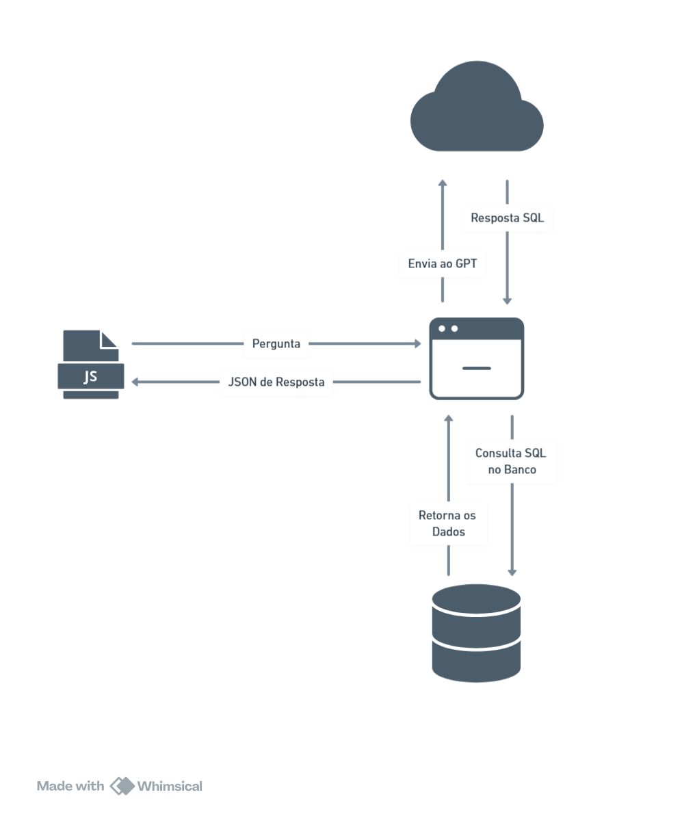

## Usando IA de forma inteligente.

Projeto desenvolvido em livecode no minicurso do **3º CONADS - Unifasipe JET - Sinop-MT**.

## 📊 Esquema do Banco de Dados

Você pode visualizar o modelo esquemático do banco de dados através do link abaixo:

🔗 [Ver esquema no DB Diagram](https://dbdiagram.io/d/CongressoADS-68473f7157d78cbaf6a57119)

## 🧱 Arquitetura do Projeto



> *Substitua o caminho acima pelo local ou URL da imagem da arquitetura do sistema.*

## 🧰 Tecnologias Utilizadas

### Frontend
- HTML
- CSS
- JavaScript
- Axios

### Backend
- Node.js
- SQLite

## 🚀 Como executar

1. Clone o repositório:
```bash
git clone https://github.com/seu-usuario/seu-repositorio.git
```

2. Instale as dependências do backend:
```bash
cd backend
npm install
```

3. Informe o token da aplicação no arquivo .env.

4. Execute o backend:
```bash
node index.js
```

5. Abra o index.html no navegador para rodar o frontend.